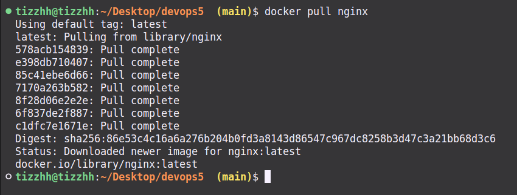
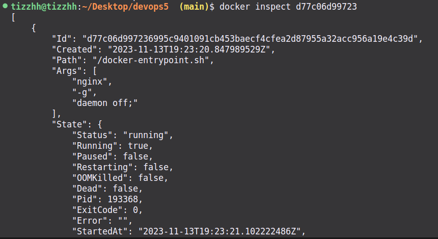
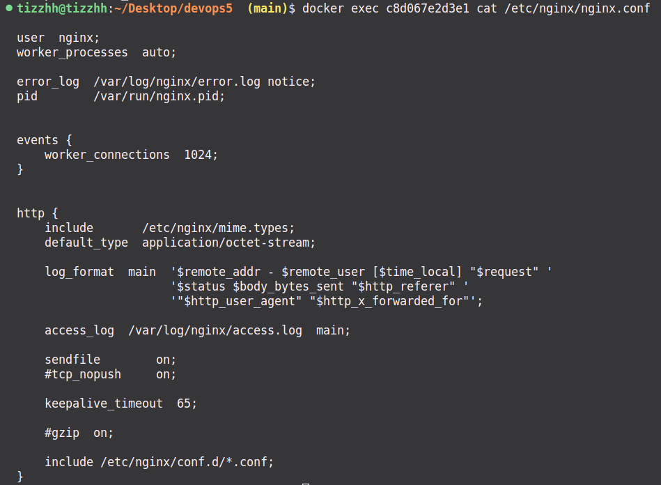
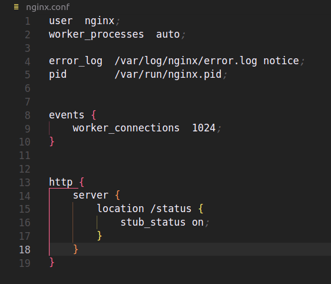
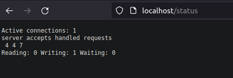
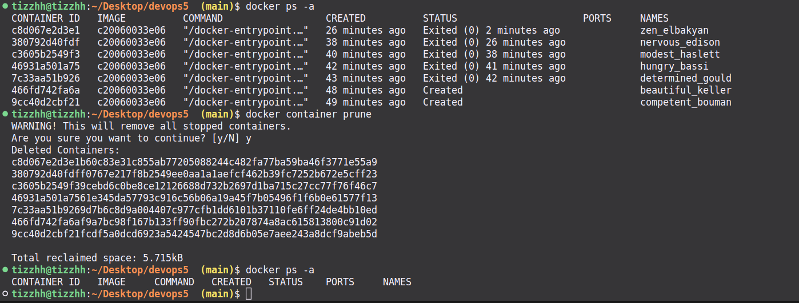

## Part 1. Готовый докер
- Взять официальный докер образ с nginx и выкачать его при помощи docker pull

- Проверить наличие докер образа через docker images

- Запустить докер образ через docker run -d [image_id|repository]

- Проверить, что образ запустился через docker ps

- Посмотреть информацию о контейнере через docker inspect [container_id|container_name]

- По выводу команды определить и поместить в отчёт размер контейнера, список замапленных портов и ip контейнера
- Размер

- список замапленных портов

- ip контейнера

- Остановить докер образ через docker stop [container_id|container_name]

- Запустить докер с портами 80 и 443 в контейнере, замапленными на такие же порты на локальной машине, через команду run

- Проверить, что в браузере по адресу localhost:80 доступна стартовая страница nginx

- Перезапустить докер контейнер через docker restart [container_id|container_name]

Проверить любым способом, что контейнер запустился

## Part 2. Операции с контейнером
- Прочитать конфигурационный файл nginx.conf внутри докер контейнера через команду exec

- Создать на локальной машине файл nginx.conf и настроить в нем по пути /status отдачу страницы статуса сервера nginx

- Скопировать созданный файл nginx.conf внутрь докер образа через команду docker cp

- Перезапустить nginx внутри докер образа через команду exec

- Проверить, что по адресу localhost:80/status отдается страничка со статусом сервера nginx

- Экспортировать контейнер в файл container.tar через команду export

- Остановить контейнер

- Удалить образ через docker rmi [image_id|repository], не удаляя перед этим контейнеры

- Удалить остановленный контейнер

- Импортировать контейнер обратно через команду import

- Запустить импортированный контейнер

- Проверить, что по адресу localhost:80/status отдается страничка со статусом сервера nginx
